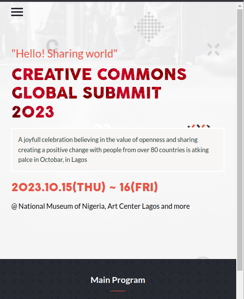
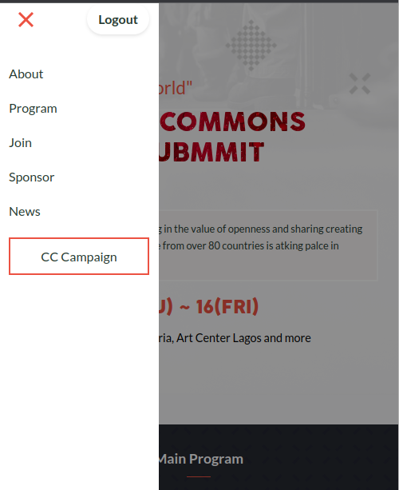
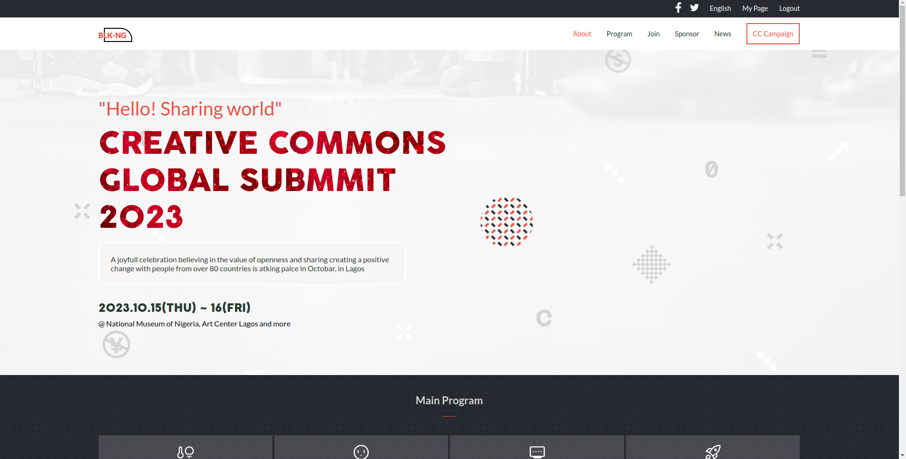
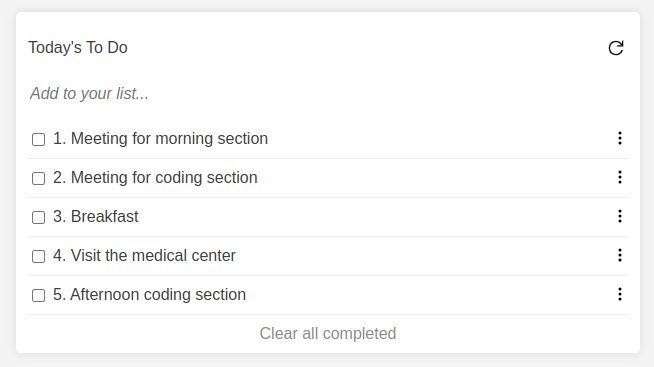
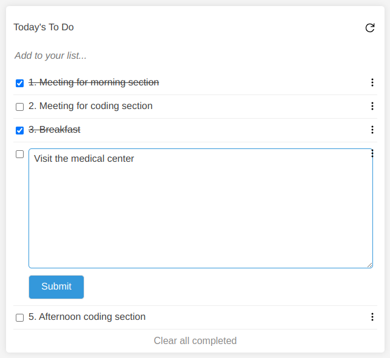

# 👋 Stanley's Portfolio 👨‍💻
Welcome to my portfolio! I'm Stanley, a full-stack software developer who specializes in using Javascript, React, Redux, Rails, and C++ to build software solutions for businesses. This is where I showcase my projects, skills, and journey in the world of software solutions.

## About Me

I'm a full-stack software developer. I love to code, research and explore. When I'm not coding or designing, you can find me feeding my livestocks, futhermore, I love to cultivate and plant trees, because I enjoy watching them grow.

## Projects

### Project 1: Capstone

- **Description:** Capstone is a simple webpage project for learning purpose
- **Tech Stack:** 
  - 
  - 
  - 
- **Demo:** [Link to Live Demo](https://sagieramos.github.io/CAPSTONE-ONE/index.html)
- **GitHub Repo:** [Link to GitHub Repository](https://github.com/sagieramos/CAPSTONE-ONE)
- **Screenshots:** 

    
    

### Project 2: ToDoList

- **Description:** To-do list is a simple web tool to keep track of tasks
- **Tech Stack:** 
  - 
  - 
  - 
  - 
- **Demo:** [Link to Live Demo](https://sagieramos.github.io/ToDoList)
- **GitHub Repo:** [Link to GitHub Repository](https://github.com/sagieramos/ToDoList)
- **Screenshots:** 
  
  

    
    

## Skills

- **Full Stack Development:** Proficient in both front-end and back-end development, capable of creating end-to-end web applications. Skilled in HTML, CSS, JavaScript, React, Node.js, and Express.js.
- **DevOps:** Proficient in implementing DevOps practices to streamline software development and deployment. Skilled in CI/CD pipelines, infrastructure automation, and configuration management using tools like Docker and Kubernetes.
- **Version Control:** Proficient in Git version control and GitHub for managing codebase changes, collaborating with teams, and ensuring code integrity.
- **Database Management:**
  - **SQL Databases:** Skilled in designing and managing relational databases like MySQL and PostgreSQL. Proficient in database schema design, querying, and optimization.
  - **NoSQL Databases:** Experienced with NoSQL databases such as MongoDB, capable of designing and implementing data models suited for various applications.
  - **Problem Solving:** Strong analytical and creative problem-solving skills, with a track record of identifying solutions that optimize processes and overcome technical challenges.
- **Embedded Systems (PlatformIO):** Skilled in developing firmware for microcontrollers using the PlatformIO environment. Proficient in integrating sensors, actuators, and other hardware components into embedded systems for various applications.

## Contact Me 📬

Let's connect! You can reach me via [Email](mailto:sagiecyber@gmail.com) or on [LinkedIn](https://www.linkedin.com/in/sagieramos/). I'm always open to interesting conversations, collaboration, and new opportunities.

## Acknowledgments 🙏

I want to express my gratitude to ALX_Africa and Microverse for their inspiration and support in my journey.

> "Quote that Represents Your Philosophy or Approach"

Feel free to explore my portfolio and get in touch. Let's build something amazing together!
